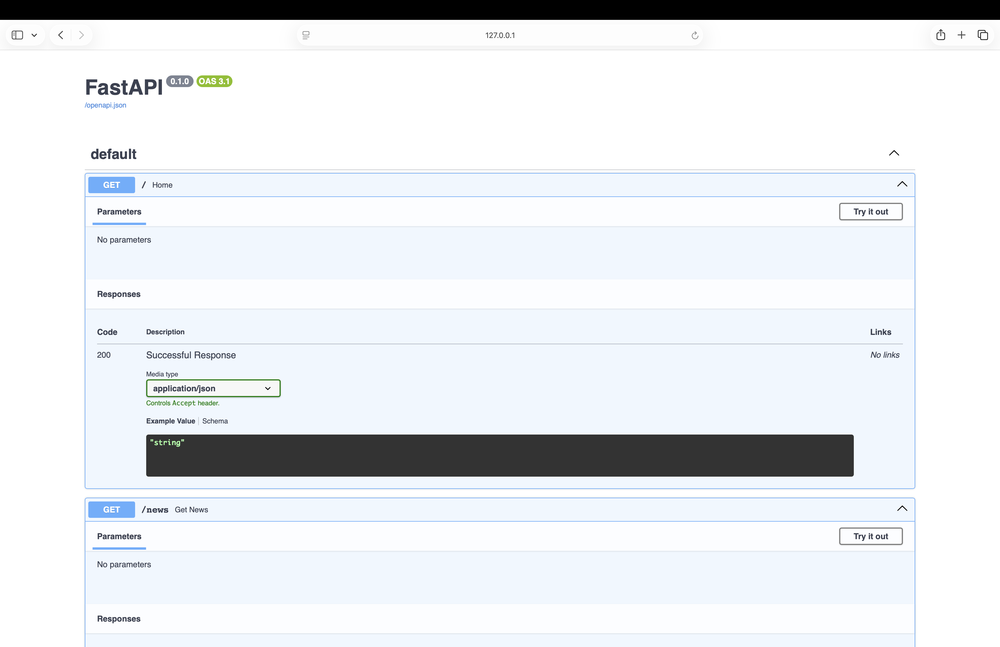

# Hacker News Scraper API

A backend system that scrapes and serves real-time data from Hacker News using FastAPI.
This project demonstrates building a lightweight data pipeline with API integration, caching, and structured data extraction.

---

## 🚀 Features

* Scrapes live data from Hacker News
* Extracts structured information (rank, title, URL)
* Exposes REST APIs using FastAPI
* Implements in-memory caching for performance optimization
* Supports query parameters for flexible data retrieval

---

## 📡 API Endpoints

| Method | Endpoint        | Description                      |
| ------ | --------------- | -------------------------------- |
| GET    | `/news`         | Fetch latest news                |
| GET    | `/news?limit=5` | Fetch limited number of articles |
| GET    | `/news/{rank}`  | Fetch article by rank            |

---

## 🖼️ API Preview



---

## 🧠 System Flow

```
Client → FastAPI → Scraper → Cache → Response
```

---

## 🛠️ Tech Stack

* Python
* FastAPI
* Requests
* BeautifulSoup
* Pandas (for data handling)

---

## ⚙️ How to Run

```bash
pip install -r requirements.txt
uvicorn api:app --reload
```

Then open:

```
http://127.0.0.1:8000/docs
```

---

## 📦 Output

* Real-time JSON response via API
* Structured data (rank, title, URL)

---

## 🎯 Learning Outcomes

* Built a web scraping pipeline for real-time data extraction
* Designed RESTful APIs using FastAPI
* Implemented caching to reduce redundant scraping
* Handled HTML parsing and structured data transformation

---

## 🔮 Future Improvements

* Add background scheduler for periodic scraping
* Implement database storage (PostgreSQL / MongoDB)
* Add async scraping for better performance
* Deploy API to cloud (Render / Railway)

---

